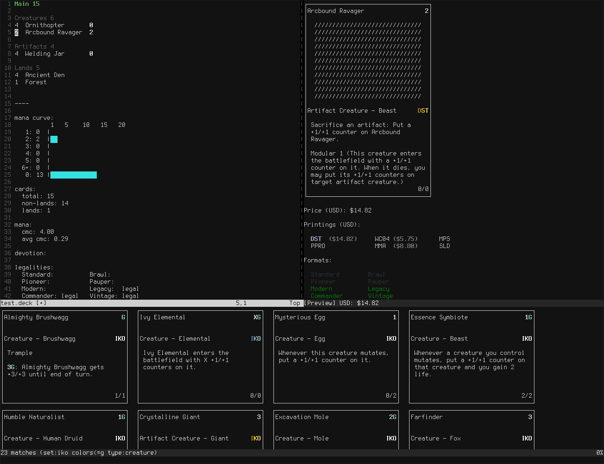

viMTG -- the VIM 'Magic: The Gathering' deck builder.

## Image

## Features

- Preview cards completely inside Vim `<Enter>`
- display your deck's stats `<localleader>p` (manacost, mana curve,
  legalities, and more)
- Format deck into sections `<localleader>p`
- Easily move cards to different sections `gm`, `gs`, `go` (Main, Sideboard,
  Other)
- Search for cards `<localleader>s`
- Add searched cards to deck `a`, `s`, `o` (Main, Sideboard, Other)
- Select sort order for search `<localleader>o`
- Limit Search to a format `<localleader>f`
- Import decks by copying and pasting universal MTG deck export format

## Installation

<!-- TODO: add new windows commands -->

Use your plugin manager of choice. On Windows, replace the directory `~/.vim`
with `~/vimfiles`.

- Vim Packages
  - `git clone --recursive https://github.com/yoshi1123/vim-mtg ~/.vim/pack/bundle/start/vim-mtg`
  - Run `:helptags ~/.vim/pack/bundle/start/vim-mtg/doc`
- [Pathogen](https://github.com/tpope/vim-pathogen)
  - `git clone --reursive https://github.com/yoshi1123/vim-mtg ~/.vim/bundle/vim-mtg`
- [Vundle](https://github.com/gmarik/vundle)
  - Add `Bundle 'https://github.com/yoshi1123/vim-mtg'` to .vimrc
  - Run `:BundleInstall`
- [NeoBundle](https://github.com/Shougo/neobundle.vim)
  - Add `NeoBundle 'https://github.com/yoshi1123/vim-mtg'` to .vimrc
  - Run `:NeoBundleInstall`
- [vim-plug](https://github.com/junegunn/vim-plug)
  - Add `Plug 'https://github.com/yoshi1123/vim-mtg'` to .vimrc
  - Run `:PlugInstall`

<!--
NOTE: its to be included as a submodule; so its included?
## Requirements

[mtgcard](https://github.com/yoshi1123/mtgcard):
  - Command-line MTG card viewer and searcher.
-->

## Updating mtgcard dependency

From `vim-mtg/`:

    git submodule update --recursive --remote

## Quick start

Example:

1. Type in cards lines in the format '4 Ancient Den', or <localleader>a
2. `:MTGSearch type:artifact`
3. Use 'a' to add the current card in search buffer to the deck, 's' to
   add to sideboard, and 'o' to add to other, with an optional COUNT
   (e.g., `4a` adds four of the currently selected card)
4. Type <localleader>p to process the deck

Deck import formats:

    Format 1                  Format 2             
    4 Ancient Den             4 x Ancient Den      
    2 Arcbound Ravager        2 x Arcbound Ravager 
    4 Welding Jar             4x Welding Jar       
    4 Ornithopter             4x Ornithopter       
    etc...                    etc...               

Search examples:

`:MTGSearch colors>=rgw type:sorcery`
    search for sorceries that are at least colors red, green, and white

`:MTGSearch format:standard colors=r type:creature text:damage`
    search for red creature cards with the word "damage" in their text

## Documentation

In Vim:

    :help vim-mtg

## Suggested plugins

- [fzf](https://github.com/junegunn/fzf):
  - Fuzzy searcher for easily adding cards with `<localleader>a`. Not a
    requirement.
